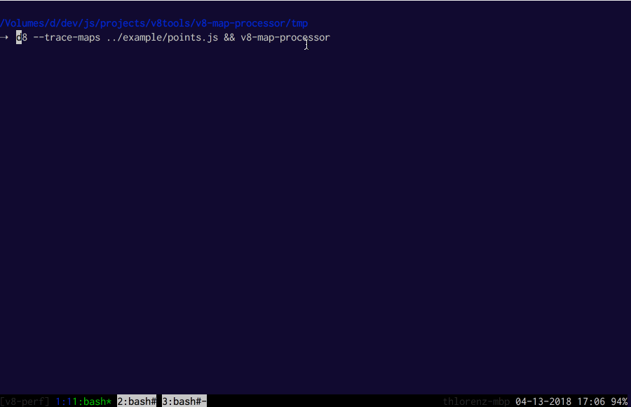

# v8-map-processor

Processes and visualizes maps (aka hidden classes) created by v8 during execution.

Derived from the one included with [v8/tools](https://github.com/v8/v8/tree/master/tools).

## Installation

    npm install -g v8-map-processor

## Usage

1a. Install Node.js `>=v10` from [nodejs.org](https://nodejs.org) or elsewhere
1b. Install d8 via `npm install -g jsvu`
    - note that d8 is named `v8` so either link it to `d8` or use `v8` when typing the next
      command
2. Run your app with d8, i.e. `<node|d8> --trace-maps example/points.js`
    - note that this will run just the JavaScript engine, so things like `setTimeout`,
      `console.log` and `process` are not available
3. Run `v8-map-processor` in the same directory to load the produced `v8.log` into the maps
  visualizer

The Stats view will show constructor and function names which can be selected to show more
information regarding related maps.

To focus on the maps created as part of the example, once you load the visualizer scroll to the
very right of the timeline to skip the maps that are created during initialization. Then you
can click on any of the bars do get more info.

In the case you ran with Node.js you'll see an overwhelming amount of data and may have to find
the maps you are interested in by searching for the constructor name via `Cmd|Ctrl-f` (in the
example case `Point`) and then selecting it in the _Stats_ view.

The following keyboard shortcuts are available:

- arrow up: select previous edge
- arrow down: select next edge
- arrow left: move to previous chunk
- arrow right: move to next chunk
- `+`: increase timeline resolution
- `-`: decrease timeline resolution
